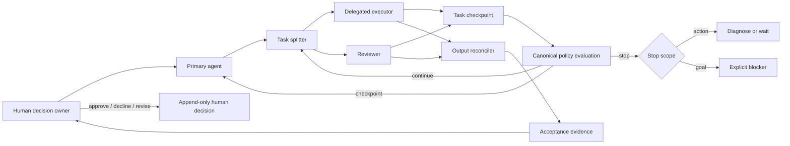

# Agent Collab Skills

[繁體中文](README.zh-TW.md) · [Public harness contract](docs/public-harness-contract.md) · [0.4 migration](docs/migration-0.4.md) · [0.5 goal-slice migration](docs/migration-0.5.md)

Provider-neutral collaboration skills plus an optional, standard-library-first
Python harness for bounded, resumable, human-authorized agent work.

This project is a governance layer, not a general agent runtime. A host supplies
models, tools, sessions, sandboxes, and tracing. Agent Collab supplies portable
roles, policy evaluation, checkpoints, proposal-only memory, reconciliation,
and acceptance evidence.

## Architecture



The deterministic layer controls state and limits. Agents produce prose,
implementation, review, and synthesis. A human remains responsible for
breaking contracts, memory promotion, semantic acceptance, and shipping.

## Seven skills

| Skill | Responsibility |
|---|---|
| `agent-task-splitter` | Create provider-neutral task packets, roles, dependencies, scopes, and acceptance criteria. |
| `agent-context-budget` | Validate policy/checkpoint context and prepare bounded handoffs without copying numeric defaults. |
| `agent-plan-act-reflect` | Run evidence-producing correction cycles with policy evaluation after each cycle and before each spawn. |
| `agent-output-reconciler` | Preserve missing and failed results while surfacing scope drift, contradictions, and conflicts. |
| `agent-debate` | Stage bounded adversarial review for genuinely contested decisions; never decide truth by vote. |
| `agent-shared-memory` | Emit proposals and append approved events; never rewrite canonical memory. |
| `agent-acceptance-gate` | Produce immutable PASS, CONDITIONAL PASS, or FAIL evidence before a separate human decision. |

## Public harness package

Distribution: `agent-collab-harness`<br>
Import: `agent_collab_harness`<br>
Command: `agent-collab`

```bash
python -m pip install agent-collab-harness
agent-collab policy validate --policy "$AGENT_COLLAB_POLICY" --json
agent-collab checkpoint validate --checkpoint .coord/checkpoint.json --json
agent-collab policy evaluate \
  --policy "$AGENT_COLLAB_POLICY" \
  --checkpoint .coord/checkpoint.json \
  --json
agent-collab checkpoint migrate \
  --checkpoint .coord/checkpoint-v1.json \
  --policy .coord/policy-v2.json \
  --metadata .coord/migration-request.json \
  --output .coord/checkpoint-v2.json
agent-collab checkpoint advance \
  --checkpoint .coord/checkpoint-v2.json \
  --policy .coord/policy-v2.json \
  --request-id stable-transition-id \
  --expected-sha256 RAW_FILE_SHA256
agent-collab doctor --json
```

Version 0.5 adds opt-in v2 goal slices; installing it does not reinterpret v1
state. `checkpoint migrate` writes a separate v2 checkpoint and leaves the v1
source untouched. `checkpoint advance` records an eligible slice transition;
stable request IDs are idempotent, while stale file hashes and lock contention
fail closed. See the [0.5 migration guide](docs/migration-0.5.md).

Runtime dependencies are standard-library only. Policy files use strict JSON;
a `.yaml` suffix is accepted only when the file content is valid JSON. An
unreadable configured policy fails closed.

`AGENT_COLLAB_POLICY` selects the one machine-readable budget source for the
run. The Codex portable adapter points it to
`${CODEX_HOME}/portable-harness/policies/agent-budget.yaml`; that v1 shape and
the public v1 JSON shape are both accepted. Human decisions and overrides are
action-hash bound and require an HMAC key supplied by the trusted host through
`AGENT_COLLAB_HUMAN_KEYS_JSON`. The matching key digest must already be pinned
in the canonical policy's `human_authorization.key_hashes`; caller-created keys
or checkpoint text alone cannot grant authority. The legacy portable v1 shape
normalizes to an empty trust root, so it can evaluate budgets but human records
fail closed until the canonical policy is explicitly upgraded.

## Role contract

Plans use four public roles:

- `primary-agent`: owns the plan, checkpoint, and human handoff;
- `delegated-executor`: performs a bounded task;
- `reviewer`: independently verifies evidence and risks;
- `synthesizer`: structures completed inputs without inventing missing work.

Provider and model selection belongs to the host adapter. It is not a public
plan field and cannot silently change during a run.

## Scratch, evidence, and memory

`.coord/` and `.ai/` are ignored scratch by default. Do not commit all
coordination output. A project may explicitly promote only:

- a checkpoint snapshot required for resume;
- a shipping artifact; or
- immutable acceptance evidence.

Memory is proposal-only. Applying, correcting, superseding, archiving, or
deleting canonical memory requires a recorded human decision. Canonical memory
is an append-only event log; old records are never edited in place.

## Install the skill bundle

```bash
claude plugin marketplace add WenyuChiou/agent-collab-skills
claude plugin install agent-collab-workspace@agent-collab-skills
```

Or use `scripts/install-all.sh` / `scripts/install-all.ps1`. The plugin and
Python package are complementary: skills describe collaboration behavior; the
package validates and evaluates the machine-readable contract.

## Development

```bash
python -m pip install -e .
python -m pytest -q
agent-collab doctor --json
```

See [CONTRIBUTING.md](CONTRIBUTING.md) for contract, test, and release rules.
Historical provider-specific incidents remain in the failure archive and are
not active routing instructions.
