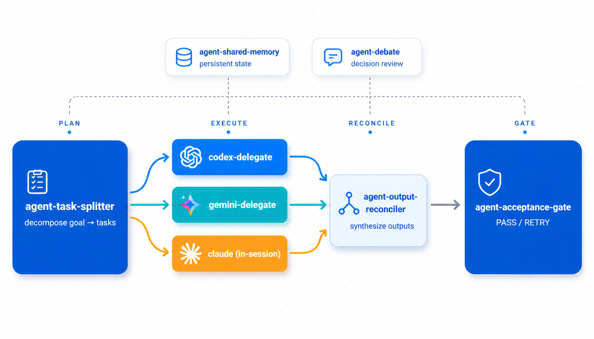

# Agent Collab Skills

[](LICENSE)

[English](README.md) ・ **繁體中文**



> 5 個 Claude Code skill，專門處理多代理協作 — task splitter、output
> reconciler、adversarial debate、shared memory、acceptance gate。
> 設計上與 [`codex-delegate`](https://github.com/WenyuChiou/codex-delegate)
> 和 [`gemini-delegate-skill`](https://github.com/WenyuChiou/gemini-delegate-skill)
> 互補組合。

聚焦於**委派之上**那一層 orchestration。現有 delegate skill 解決的是
「Claude → Codex / Gemini 的單次交手」；這個 catalog 處理的是後面的
問題：怎麼把一個目標切給多個 agent、怎麼把它們的輸出對帳、怎麼跨
session 記住決策、怎麼把好幾個 agent 的成果合併進主分支。

姊妹 marketplace：[`ai-research-skills`](https://github.com/WenyuChiou/ai-research-skills)
（13 個 skill，研究流程專用）。

---

## 安裝

前置：Claude Code（https://claude.ai/code）。建議（非必要）已透過
`ai-research-skills` 安裝 `codex-delegate` 與 `gemini-delegate`，並把
對應的 CLI binary 放到 PATH 上。

```bash
claude plugin marketplace add WenyuChiou/agent-collab-skills
claude plugin install agent-collab-workspace@agent-collab-skills
```

這個 bundle 會一次裝齊 5 個 skill。確認：

```bash
claude plugin list
ls ~/.claude/skills/   # 應該看到 agent-task-splitter 等等
```

也可以用 helper script：

```bash
bash scripts/install-all.sh        # macOS / Linux / git-bash
pwsh scripts/install-all.ps1       # Windows PowerShell
```

### 需要改 `CLAUDE.md` 嗎？

**不用**。Claude Code 內建的 skill matching 會讀每個 `SKILL.md` 的 `description` 欄位、自動把使用者語句對到對應的 skill。Plugin 安裝是唯一一步 — 你說「把這個切給 Claude、Codex、Gemini」就會自動觸發 `agent-task-splitter`，不需要額外設定。

以下兩種情況你*可以選擇*顯式把規則寫進 `~/.claude/CLAUDE.md`：

- 你的 `CLAUDE.md` 已經有跟這些 skill 競爭的 delegation 協議（例如「永遠手寫 codex task 檔」這種既有硬規則，會搶走 routing 優先權）
- 想強制特定行為（例如「multi-agent round 合併前一律跑 `agent-acceptance-gate`」）

否則就讓 `CLAUDE.md` 維持原樣 — 這些 skill 預設靠 description-based discovery 運作。

---

## 5 個 Skill

| Skill | 觸發語句 | 寫到 `.coord/` |
|---|---|---|
| **`agent-task-splitter`** | 「把這個任務分給 Claude / Codex / Gemini」/「為 X 規劃多代理執行」 | `plan.yml` + `.ai/codex_task_*.md` / `.ai/gemini_task_*.md` |
| **`agent-output-reconciler`** | 「對帳這 N 份代理輸出」/「Codex 跟 Gemini 的結果一致嗎？」 | `reconciliation_<NNN>.md` |
| **`agent-debate`** | 「讓 Claude 跟 Codex 辯論這個設計」/「對 X 做對抗式評審」 | `debate_<topic>.md` |
| **`agent-shared-memory`** | 「把 X 寫進共享記憶」/「目前所有 agent 對這專案做過哪些決策？」 | `memory.yml` |
| **`agent-acceptance-gate`** | 「跑 acceptance gate」/「合併前的預檢」 | `acceptance_<NNN>.md` |

`<NNN>` 編號對應 `plan.yml` 裡的 `round` 欄位，方便把產物追溯回是哪一
輪多代理執行所產出。

---

## 怎麼組合

```
goal
  ↓ agent-task-splitter
.coord/plan.yml + .ai/codex_task_*.md / .ai/gemini_task_*.md
  ↓ codex-delegate / gemini-delegate（既有）
.ai/codex_log_*.txt + .result.json + codex_result_*.md
  ↓ agent-output-reconciler
.coord/reconciliation_<NNN>.md
  ↓ agent-acceptance-gate
.coord/acceptance_<NNN>.md → 合併或重試
```

`agent-shared-memory` 跟整個 pipeline 同步進行 — 每一步都會更新它。
`agent-debate` 只在「重大決策點」上呼叫（架構、設計選擇），不進主
迴圈。

完整實跑範例（含 `.coord/` 樣本檔，誠實記錄真實的多代理執行長什麼
樣）：[docs/example-walkthrough.md](docs/example-walkthrough.md)。

---

## 為什麼是這 5 個

每一個解決的痛點，按順序：

1. **任務切分很燒腦力。** 你現在每次都在腦中分類「這是 Codex 形狀的
   還是 Gemini 形狀的？」。Splitter 把這個 heuristic 編成可重用的
   skill。
2. **多代理輸出很難對比。** 三個平行的 Codex job 跑回來，你打開三份
   `result.json` 用人腦合併。Reconciler 替你做 diff。
3. **共識式 LLM 輸出會藏起 trade-off。** 你問一個 agent 拿到一個答
   案；Debate skill 強制兩個 agent 站對立面，逼出真正的張力。
4. **跨 session 沒有共享記憶。** Codex resume 只在自己 session 內有效；
   Claude session A → Codex session B → Gemini session C 之間什麼都不
   會留下。Shared-memory 把 `.coord/memory.yml` 變成跨 session 的黑
   板。
5. **沒有標準化的合併閘。** 你現在用肉眼看 diff 加手動跑 `pytest`。
   Gate 自動跑 `plan.yml` 裡所有 `success_criteria`、加成本預算、加
   跨代理一致性檢查。

---

## 與下列專案組合

- [`codex-delegate`](https://github.com/WenyuChiou/codex-delegate) —
  消費 splitter 的輸出，產出餵給 reconciler。
- [`gemini-delegate-skill`](https://github.com/WenyuChiou/gemini-delegate-skill)
  — 同上。
- [`academic-writing-skills`](https://github.com/WenyuChiou/academic-writing-skills)
  — 若散文有變動，acceptance gate 可選擇呼叫其 banned-word audit。

---

## 已知問題

- **Gemini-cli 拒讀 gitignored 檔案。** `.ai/` 目錄按慣例會被 gitignore
  以避免暫存 task 檔被 commit；但 `gemini -p "Read .ai/gemini_task_*.md"`
  會回 `file ignored by configured ignore patterns`。**Workaround**：
  把 task 內容直接內嵌到 prompt body 裡：
  ```bash
  TASK=$(cat .ai/gemini_task_<NNN>_<slug>.md)
  gemini -p "$TASK" --yolo \
    < /dev/null > .ai/gemini_log_<NNN>_<slug>.txt 2>&1
  ```
  副作用：gemini 沒有檔案系統上下文，task 檔裡引用的路徑它讀不到 —
  所以 prompt 本身要包含所有關鍵內容，不能只留路徑。Splitter 的
  step 6b 已記錄這個處理方式。
- **`codex` 和 `gemini` 在 stdin 開著時會卡在啟動。** 從 script 或
  非互動 shell 啟動時，codex-cli ≥ 0.121.0 會印 "Reading additional
  input from stdin..." 然後永遠卡住。gemini-cli 同樣狀況。
  **Workaround**：每次直接呼叫都把 stdin 導到 `/dev/null`：
  ```bash
  codex exec --full-auto -m <model> "<prompt>" \
    < /dev/null > .ai/codex_log_<NNN>_<slug>.txt 2>&1
  ```
  `codex-delegate` 的 wrapper script 內部已處理；只有直接呼叫
  `codex exec` / `gemini -p` 時需要顯式加。
- **Codex 讀 gitignored 檔案沒問題** — 只有 gemini 有 gitignore 衝突。
- **完整實跑範例**（含 `.coord/` 樣本檔與誠實記錄真實多代理執行的
  狀況）：[docs/example-walkthrough.md](docs/example-walkthrough.md)。

---

## Status & License

MIT。早期階段 — SKILL.md 的 prompt 骨架已完成並在真實工作流測試
過；若有 skill 失靈或 `.coord/` schema 在你的使用場景中不適用，歡迎
開 issue。

歡迎貢獻 — 見 [CONTRIBUTING.md](CONTRIBUTING.md) 了解 catalog ↔
delegate-skill 之間的互通規則。
