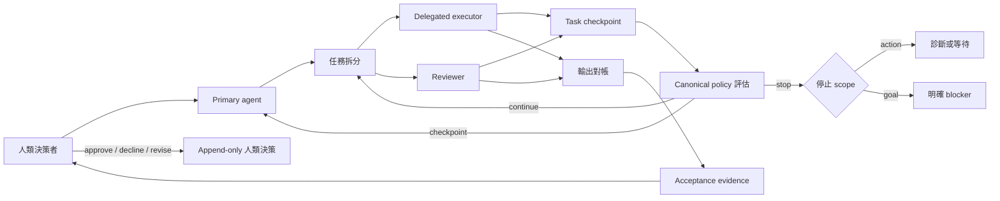

# Agent Collab Skills

[English](README.md) · [公開 harness 合約](docs/public-harness-contract.md) · [0.4 遷移指南](docs/migration-0.4.md) · [0.5 goal-slice 遷移指南](docs/migration-0.5.md)

本文件使用繁體中文。

一組 provider-neutral 的協作 skills，搭配可選、standard-library-first 的
Python harness，用於有界、可恢復且由人類授權的 agent 工作流程。

本專案是治理層，不是通用 agent runtime。Host 負責模型、工具、session、
sandbox 與 tracing；Agent Collab 提供可攜式角色、policy 評估、checkpoint、
proposal-only memory、結果對帳與 acceptance evidence。

## 架構


```mermaid
flowchart LR
    H[人類決策者] --> P[Primary agent]
    P --> S[任務拆分]
    S --> E[Delegated executor]
    S --> R[Reviewer]
    E --> C[Task checkpoint]
    R --> C
    C --> Y[Canonical policy 評估]
    Y -->|continue| S
    Y -->|checkpoint| P
    Y -->|stop| Q{停止 scope}
    Q -->|action| X[診斷或等待]
    Q -->|goal| B[明確 blocker]
    E --> O[輸出對帳]
    R --> O
    O --> A[Acceptance evidence]
    A --> H
    H -->|approve / decline / revise| D[Append-only 人類決策]
```

Deterministic layer 控制狀態與限制；agents 負責 prose、實作、review 與
synthesis。破壞性合約、memory promotion、語意驗收與 shipping 仍由人類
負責。

## 七個 skills

| Skill | 職責 |
|---|---|
| `agent-task-splitter` | 建立 provider-neutral task packets、角色、依賴、scope 與 acceptance criteria。 |
| `agent-context-budget` | 驗證 policy/checkpoint context，建立有界 handoff，不複製數值預設。 |
| `agent-plan-act-reflect` | 執行產生證據的修正循環；每輪後與每次 spawn 前重新評估 policy。 |
| `agent-output-reconciler` | 保留缺失與失敗結果，呈現 scope drift、矛盾與衝突。 |
| `agent-debate` | 為真正有爭議的決策進行有界 adversarial review；不以投票決定事實。 |
| `agent-shared-memory` | 只產生 proposal 並附加已核准事件；不覆寫 canonical memory。 |
| `agent-acceptance-gate` | 在獨立的人類決策前，產生不可變的 PASS、CONDITIONAL PASS 或 FAIL 證據。 |

## 公開 harness package

Distribution：`agent-collab-harness`<br>
Import：`agent_collab_harness`<br>
Command：`agent-collab`

```bash
python -m pip install agent-collab-harness
agent-collab policy validate --policy "$AGENT_COLLAB_POLICY" --json
agent-collab checkpoint validate --checkpoint .coord/checkpoint.json --json
agent-collab policy evaluate \
  --policy "$AGENT_COLLAB_POLICY" \
  --checkpoint .coord/checkpoint.json \
  --json
agent-collab checkpoint migrate \
  --checkpoint .coord/checkpoint-v1.json \
  --policy .coord/policy-v2.json \
  --metadata .coord/migration-request.json \
  --output .coord/checkpoint-v2.json
agent-collab checkpoint advance \
  --checkpoint .coord/checkpoint-v2.json \
  --policy .coord/policy-v2.json \
  --request-id stable-transition-id \
  --expected-sha256 RAW_FILE_SHA256
agent-collab doctor --json
```

0.5 版新增 opt-in v2 goal slices；安裝新版不會重新解讀 v1 狀態。
`checkpoint migrate` 會另寫 v2 checkpoint，並保留原始 v1 檔案；
`checkpoint advance` 記錄符合條件的 slice transition。穩定 request ID 具有
idempotent 行為；過期檔案 hash 或 lock contention 會 fail closed。詳見
[0.5 遷移指南](docs/migration-0.5.md)。

Runtime 僅使用 Python standard library。Policy 採嚴格 JSON；只有內容本身
是有效 JSON 時才接受 `.yaml` 副檔名。已設定但無法讀取的 policy 會 fail
closed。

`AGENT_COLLAB_POLICY` 為每次執行選定唯一的機器可讀 budget 來源。Codex
portable adapter 會將它指向
`${CODEX_HOME}/portable-harness/policies/agent-budget.yaml`；系統同時接受該
v1 格式與公開 v1 JSON 格式。Human decision 與 override 均綁定 action hash，
並需由可信任 host 透過 `AGENT_COLLAB_HUMAN_KEYS_JSON` 提供 HMAC key；僅修改
checkpoint 文字無法取得授權。對應的 key digest 必須預先固定在 canonical
policy 的 `human_authorization.key_hashes`；呼叫者自建的 key 不具權限。Legacy
portable v1 會正規化為空 trust root，因此仍可評估 budget，但在 canonical
policy 明確升級前，所有 human record 都會 fail closed。

## 角色合約

Plan 使用四個公開角色：

- `primary-agent`：負責 plan、checkpoint 與 human handoff；
- `delegated-executor`：執行有界任務；
- `reviewer`：獨立驗證證據與風險；
- `synthesizer`：結構化已完成輸入，不捏造缺失結果。

Provider 與 model 選擇屬於 host adapter，不是公開 plan 欄位，也不能在執行
期間靜默切換。

## Scratch、證據與 memory

`.coord/` 與 `.ai/` 預設為 gitignored scratch。不要提交全部 coordination
output。專案只能明確 promote：

- resume 所需的 checkpoint snapshot；
- shipping artifact；或
- 不可變 acceptance evidence。

Memory 一律 proposal-only。套用、修正、supersede、封存或刪除 canonical
memory 都需要已記錄的人類決策。Canonical memory 是 append-only event log，
不會就地修改舊記錄。

## 安裝 skill bundle

```bash
claude plugin marketplace add WenyuChiou/agent-collab-skills
claude plugin install agent-collab-workspace@agent-collab-skills
```

也可使用 `scripts/install-all.sh` 或 `scripts/install-all.ps1`。Plugin 與
Python package 是互補層：skills 描述協作行為；package 驗證並評估
machine-readable contract。

## 開發

```bash
python -m pip install -e .
python -m pytest -q
agent-collab doctor --json
```

合約、測試與 release 規則請見 [CONTRIBUTING.md](CONTRIBUTING.md)。歷史
provider-specific 事件只保留在 failure archive，不是 active routing 指令。
